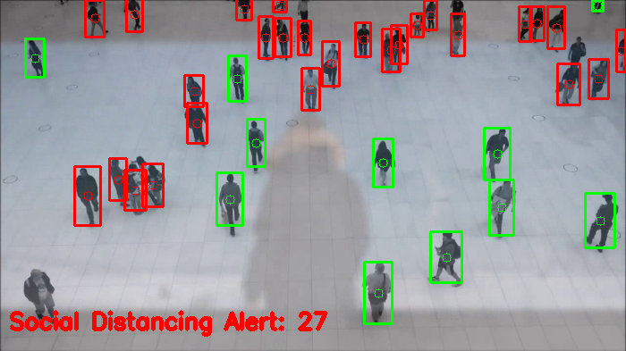

# Data-Analysis-Portfolio

## About me
Hello everyone! My name is Virinchi, and this is my portfolio. 
I am a Business Analytics Major at Isenberg School of Management. I honed my cloud infrastructure skills as a DevOps Engineer over 2 years. Simultaneously, I led the marketing of a nationwide NGO dedicated to empowering underprivileged students in India. During my tenure there, I achieved a groundbreaking increase in newsletter signups by 62% to reach 9000 subscribers in just one year. an experience that emphasized the power of data-driven decisions. My Academic journey has fortified my knowledge of data-driven strategy, marketing analytics, and optimization techniques. Furthermore, I am proficient in advanced Excel, Google Analytics, and visualization tools. 
I am both a team player and a decisive leader. 

You can see more information in my [**CV**](https://github.com/almostoutlier/Data-Analysis-Portfolio/blob/main/Virinchi%20Alahari%20Resume.pdf).

This repository was created to showcase my analytical and technical skills (Excel, Python, R, SQL, Tableau, Power BI, PowerPoint, and others).
## Contents
* [About me](#about-me)
* [Portfolio Projects](#portfolio-projects)
  - [Sonar (Rocks vs. Mines)](#sonar) 
  - [Social Distancing Monitor](#social-distancing-monitor) 
  - [Humanoid Robot](#robot)
  - [Pokémon EDA](#pokemon-analysis)
* [Study projects](#study-projects)
  - [Movie Over Time Analysis](#movie-analysis)
  - [Excel Exercises](#excel-exercises)
  - [SQL Exercises](#sql-exercises)
* [Certificates](#certificates)
* [Contacts](#contacts)
## Portfolio Projects
This section contains a list of projects with brief descriptions.
### Sonar (Rocks vs. Mines) 
**Description:** The dataset, sourced from the XYZ website, encompasses two files: "sonar.mines" and "sonar.rocks." It contains a total of 111 patterns from sonar signals bounced off metal cylinders and 97 patterns from rocks, gathered under similar conditions. Each pattern comprises 60 numbers indicating energy within frequency bands over time, with labels "R" for rocks and "M" for mines, sorted by aspect angles. These files are consolidated into one dataset named "sonar.all-data." After meticulous data preprocessing and feature engineering, the logistic regression model was fine-tuned to optimize its predictive capabilities. With an R-squared value of 0.81, indicating the proportion of variance in the target variable explained by the model, and an accuracy rate of 88%, the logistic regression model demonstrated robustness in distinguishing between rocks and mines based on the sonar data patterns. 
**Dataset:** <a href = "https://archive.ics.uci.edu/dataset/151/connectionist+bench+sonar+mines+vs+rocks"> 
<code>Connectionist Bench Sonar Mines vs Rocks</code></a>  
**Code:**   

### Social Distancing Monitor
**Description:** We will employ YOLOv3, pretrained on the COCO dataset, for object detection. While single-stage detectors like YOLO may be less accurate than two-stage detectors, they offer significant speed advantages. YOLO treats object detection as a regression problem, predicting bounding box coordinates and class label probabilities simultaneously. It returns person prediction probabilities, bounding box coordinates, and centroids. Non-maxima suppression (NMS) is applied to reduce overlapping bounding boxes. Centroids of the detections are computed, and pairwise distances are analyzed to identify people within a certain pixel distance threshold. 
**Colab:**   

## Acadamic Projects
This section contains a list of projects which are a part of my acadamics with brief descriptions.

### Movie Performance Overtime 
**Description:** The TMDB dataset, encompassing over 700,000 movies up to July 2023, provides a comprehensive array of data points including cast, crew, plot keywords, budget, revenue, and more. To enhance usability, the dataset underwent meticulous cleaning, refining the initial .csv format by eliminating blank fields in key metrics. This refinement resulted in a condensed dataset of 9,678 movies. Additionally, calculated fields for gross profit and profit percentage were introduced. Leveraging Tableau, filters were implemented to distinguish between animated and conventional genres, while data integration techniques were applied to enhance insights, particularly focusing on the highest-grossing actors. This curated dataset serves as a versatile tool for researchers, analysts, and industry professionals, facilitating various applications from historical analysis to predictive modeling of box office revenue. 
**Dataset:** <a href = "https://www.kaggle.com/datasets/akshaypawar7/millions-of-movies"> 
<code>Movies Daily Update Dataset</code></a>  
**Powerpoint & Dashboard:** <a href = "https://docs.google.com/presentation/d/1ZDyQ4bzW7ycv3ulfHb307G-25ZoXJPkw/edit?usp=sharing&ouid=100940698311259880524&rtpof=true&sd=true">
<code>Slides</code></a>  

## Contact
**Mail:** alaharivirinchi123@gmail.com 
**LinkedIn:** <a href = "https://www.linkedin.com/in/alahari-virinchi/"> 
<code>Alahari Virinchi</code></a>  
