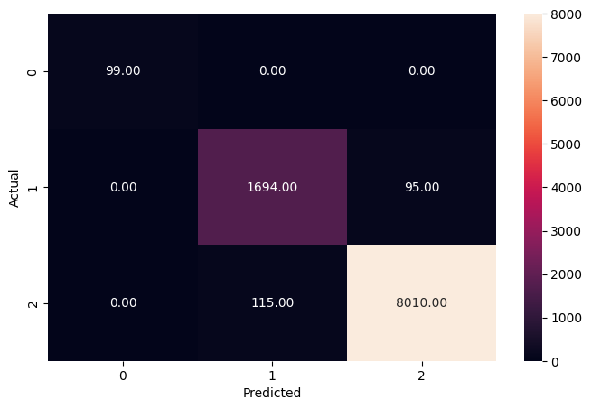

# Data-Analysis-Portfolio

Welcome to my Data Analysis Portfolio! This repository showcases a collection of my data analysis projects, demonstrating my skills and expertise in data analysis, data engineering, visualization, and machine learning. 

## Contents
* [About me](#about-me)
* [Portfolio Projects](#portfolio-projects)
  - [ATS Optimized Custom Resume Generator](#ATS-Optimized-Custom-Resume-Generator) 
  - [Sonar (Rocks vs. Mines)](#Sonar ) 
  - [Social Distancing Monitor](#social-distancing-monitor) 
  - [Humanoid Robot](#robot)
  - [Pokémon EDA](#pokemon-analysis)
* [Acadamic Projects](#Acadamic-Projects)
  - [Flight Delay Prediction](#flight-delay-prediction)
  - [Movie Over Time Analysis](#movie-performance-overtime)
  - [Excel Exercises](#excel-exercises)
  - [R Exercises](#R-exercises)
  - [SQL Exercises](#sql-exercises)
* [Certificates](#certificates)
* [Contacts](#contacts)

## About me
I am a Business Analytics Major at Isenberg School of Management. I honed my cloud infrastructure skills as a DevOps Engineer over 2 years. Simultaneously, I led the marketing of a nationwide NGO dedicated to empowering underprivileged students in India. During my tenure there, I achieved a groundbreaking increase in newsletter signups by 62% to reach 9000 subscribers in just one year. an experience that emphasized the power of data-driven decisions. My Academic journey has fortified my knowledge of data-driven strategy, marketing analytics, and optimization techniques. Furthermore, I am proficient in advanced Excel, Google Analytics, and visualization tools. 
I am both a team player and a decisive leader. 

You can see more information in my [**CV**](https://github.com/almostoutlier/Data-Analysis-Portfolio/blob/main/Virinchi%20Alahari%20Resume.pdf).

This repository was created to showcase my analytical and technical skills (Excel, Python, R, SQL, Tableau, Power BI, PowerPoint, and others).

## Portfolio Projects
This section contains a list of projects with brief descriptions.

### ATS Optimized Custom Resume Generator
**Description:** 
- Utilizes the `python-docx` library and the Gemini API to create professional, ATS (Applicant Tracking System) optimized resumes in the Microsoft Word format.
- Analyzes job descriptions with the Gemini API to generate tailored resumes with optimized content and keyword placement, ensuring a high ATS score.
- Takes user inputs for personal information, education, experience, skills, and academic projects to generate well-structured, visually appealing resumes.
- Optimizes resumes for Applicant Tracking Systems using industry-standard formatting, section headings, and keywords extracted from job descriptions.
- Presents education and experience sections in a tabular format with adjustable column widths and appropriate formatting for readability. 

**Tech Stack:**
- **Programming Language:** Python
- **Libraries:** python-docx, Gemini API
- **Tools:** Jupyter Notebook

**Output Resume:** <a href = "https://github.com/almostoutlier/Main/blob/main/Project%20Data/ATS_Optimized_Resume.docx"> 
<code>ATS_Optimized_Resume</code></a>  
**Code:** <a href = "https://github.com/almostoutlier/Projects/blob/main/Custom_Resume_Generator.ipynb">
<code>Code</code></a>  
 

### Sonar
**Description:** 
- Dataset sourced from the Archive ICS UCI  website, encompassing two files: "sonar.mines" and "sonar.rocks."
- Contains 111 patterns from sonar signals bounced off metal cylinders and 97 patterns from rocks, gathered under similar conditions.
- Each pattern comprises 60 numbers indicating energy within frequency bands over time, labeled "R" for rocks and "M" for mines, sorted by aspect angles.
- Files are consolidated into one dataset named "sonar.all-data."
- After meticulous data preprocessing and feature engineering, the logistic regression model was fine-tuned, achieving an R-squared value of 0.81 and an accuracy rate of 88%, demonstrating robustness in distinguishing between rocks and mines based on sonar data patterns. 

**Tech Stack:**
- **Programming Language:** Python
- **Libraries:** pandas, numpy, scikit-learn, matplotlib
- **Tools:** Jupyter Notebook

**Dataset:** <a href = "https://archive.ics.uci.edu/dataset/151/connectionist+bench+sonar+mines+vs+rocks"> 
<code>Connectionist Bench Sonar Mines vs Rocks</code></a>  
**Code:** <a href = "https://github.com/almostoutlier/Projects/blob/main/Rocks_vs_Mines.ipynb">
<code>Code</code></a>  
 

### Social Distancing Monitor
**Description:** 
- Employ YOLOv3, pretrained on the COCO dataset, for object detection.
- YOLO offers speed advantages despite being potentially less accurate than two-stage detectors.
- Treats object detection as a regression problem, predicting bounding box coordinates and class label probabilities simultaneously.
- Returns person prediction probabilities, bounding box coordinates, and centroids.
- Applies non-maxima suppression (NMS) to reduce overlapping bounding boxes.
- Computes centroids of detections and analyzes pairwise distances to identify people within a certain pixel distance threshold. 

**Tech Stack:**
- **Programming Language:** Python
- **Framework:** YOLOv3
- **Pretrained Model:** COCO dataset
- **Libraries:** OpenCV, NumPy
- **Techniques:** Non-maxima suppression (NMS)

**Colab:**   

## Acadamic Projects
This section contains a list of projects which are a part of my acadamics with brief descriptions.

### Flight Delay Prediction 
**Description:** 
- Dataset includes information about flights in three modules: Airlines, Airports, and Flights.
- All required data is present in the "Flights" module, including flight details, departure and arrival airports, delays, cancellations, and reasons.
- Using this data to predict the status of the flight and the corresponding reason.
- Objectives:
  - Predict if a flight will be on time, delayed, or cancelled.(Multiclass Classification Model)

Confusion Matrix on Test Data

                precision    recall  f1-score   support
           C       1.00      1.00      1.00        99
           D       0.94      0.95      0.94      1789
           N       0.99      0.99      0.99      8125
    accuracy                           0.98     10013

  - If delayed, by how many minutes? (Multilabel Classification Model)

Confusion Matrix on Test Data
Accuracy Score:  0.8561869569559573
Hamming Loss:  0.05

AIR_SYSTEM_DELAY | SECURITY_DELAY | AIRLINE_DELAY | LATE_AIRCRAFT_DELAY |  WEATHER_DELAY
--- | --- | --- | --- | ---
[[[8947  265]  |  [[9997    0]  | [[9156  208]  |   [[8918  275]   |   [[9666   47]
[ 442  359]]  |  [  16    0]]  |  [ 482  167]]  |   [ 355  465]]   |  [ 261   39]]]

  - If cancelled, what could be the reason for cancellation? (Regression Model)
 Data | RMSE | MAE | MAPE 
--- | --- | --- | --- 
Train | 32.210859 | 24.042234 | 0.444889
Val | 32.409667 | 24.199183 | 0.449289
Test | 32.224404 | 24.060442 | 0.441072 
 

**Tech Stack:**
- **Programming Language:** Python
- **Libraries:** pandas, numpy, scikit-learn, matplotlib
- **Tools:** Jupyter Notebook

**Dataset:** <a href = "https://www.kaggle.com/datasets/usdot/flight-delays?select=flights.csv"> 
<code>2015 Flight Delays and Cancellations</code></a>  
**Link:** <a href = "https://github.com/almostoutlier/Projects/blob/main/Flights_Delay.ipynb">
<code>Github Link</code></a>  

### Movie Performance Overtime 
**Description:** 
- The TMDB dataset, initially encompassing over 700,000 movies, was meticulously cleaned and refined to 9,678 movies, including key metrics such as cast, crew, budget, revenue, and calculated fields for gross profit and profit percentage.
- Leveraging Tableau, filters were implemented to distinguish between animated and conventional genres, and data integration techniques enhanced insights, particularly focusing on the highest-grossing actors.
- This curated dataset is a versatile tool for researchers, analysts, and industry professionals, facilitating various applications from historical analysis to predictive modeling of box office revenue. 

**Tech Stack:**
- **Programming Language:** Python
- **Libraries:** pandas, numpy, scikit-learn, matplotlib
- **Tools:** Jupyter Notebook

**Dataset:** <a href = "https://www.kaggle.com/datasets/akshaypawar7/millions-of-movies"> 
<code>Movies Daily Update Dataset</code></a>  
**Powerpoint & Dashboard:** <a href = "https://docs.google.com/presentation/d/1ZDyQ4bzW7ycv3ulfHb307G-25ZoXJPkw/edit?usp=sharing&ouid=100940698311259880524&rtpof=true&sd=true">
<code>Slides</code></a>  

## Certificates
* [Introduction to Airflow in Python Certificate](https://github.com/almostoutlier/Certificates/blob/main/airflow%20in%20python.pdf) - Datacamp, 2024
**Link to coding Exercises:** <a href = "https://github.com/almostoutlier/Projects/blob/main/Datacamp_Introduction_to_Airflow_Certification_Excersises.ipynb">
<code>Airflow Exercises</code></a>  
* [Introduction to Data Pipelines Certificate](https://github.com/almostoutlier/Certificates/blob/main/Introduction_to_Data_Pipelines.pdf) - Datacamp, 2024
* [Supervised Learning with scikit-learn Certificate](https://github.com/almostoutlier/Certificates/blob/main/Supervised_Learning_with_Scikit-learn.pdf) - Datacamp, 2024
* [Introduction to Python Certificate](https://github.com/almostoutlier/Certificates/blob/main/Introduction_to_Python.pdf) - Datacamp, 2024
* [Data Scientist's Toolbox Certificate by John Hopkins University](https://github.com/almostoutlier/Certificates/blob/main/DataScientistToolbox_Coursera.pdf) - Coursera, 2020
* [Data Manipulation with Pandas Certificate](https://github.com/almostoutlier/Certificates/blob/main/Data_Manipulation_with_Pandas.pdf) - Datacamp, 2024
* [Algorithmic Toolbox Certificate by UC San Diego](https://github.com/almostoutlier/Certificates/blob/main/AlgorithmicToolbox_Coursera.pdf) - Coursera, 2020
* [AWS Fundamentals Certificate](https://github.com/almostoutlier/Certificates/blob/main/AWS_Coursera.pdf) - Coursera, 2020
* [Crash Course on Python Certificate by Google](https://github.com/almostoutlier/Certificates/blob/main/PythonCrashCourse_Coursera.pdf) - Coursera, 2020
* [Inspiring and Motivating Individuals Certificate by University of Michigan](https://github.com/almostoutlier/Certificates/blob/main/Inspiring%26Motivating_Coursera.pdf) - Coursera, 2020

## Contact
**Mail:** alaharivirinchi123@gmail.com 
**LinkedIn:** <a href = "https://www.linkedin.com/in/alahari-virinchi/"> 
<code>Alahari Virinchi</code></a>  
